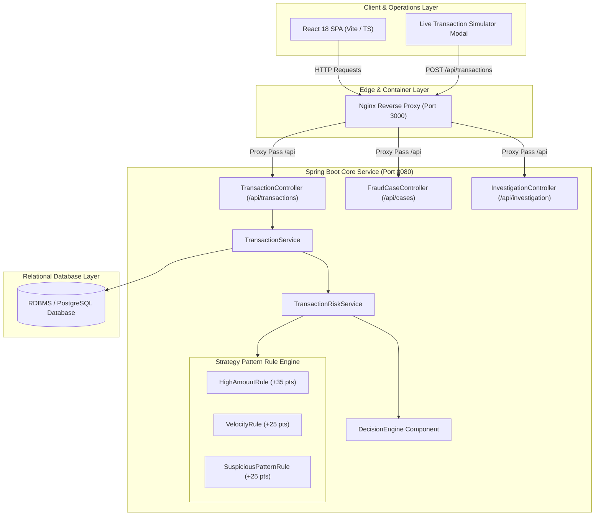
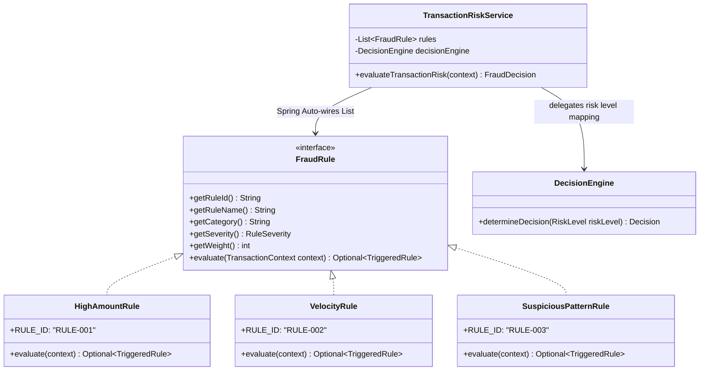
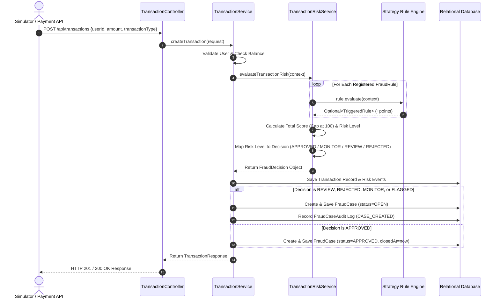
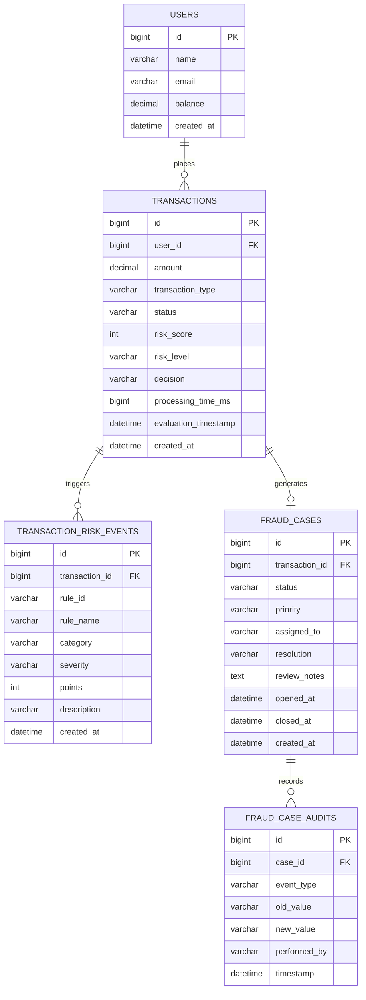

# 🛡️ Enterprise Financial Transaction Risk Analysis & Fraud Detection Engine (Risk Sentinel)

[](https://jdk.java.net/)
[](https://spring.io/projects/spring-boot)
[](https://react.dev/)
[](https://www.typescriptlang.org/)
[](https://www.docker.com/)
[](https://refactoring.guru/design-patterns/strategy)
[](LICENSE)

---

## 📌 Executive Overview & Business Problem

High-volume payment networks processing financial transactions face rapid, evolving fraud vectors. Monolithic legacy systems with hardcoded `if-else` conditional branches are fragile, difficult to extend, lack auditability, and fail to provide compliance analysts with real-time operational visibility.

**Risk Sentinel** is an enterprise-grade, microservice-ready **Real-Time Transaction Risk Analysis & Fraud Detection Platform**. Built following domain-driven design (DDD), SOLID software principles, and the Gang-of-Four **Strategy Design Pattern**, it evaluates incoming transaction risk in sub-5 milliseconds, auto-determines risk tiers, executes business policies, and provides a sleek True-Black compliance portal for fraud analysts.

---

## ✨ Key Enterprise Capabilities

1. **Pluggable Strategy Pattern Rule Engine**: Decouples fraud detection rules from orchestration logic. Add new indicators (e.g. Geofencing, Velocity, Device Fingerprinting) without modifying existing evaluation code.
2. **Deterministic Risk Scoring & Decision Mapping**: Capped risk scoring (0 to 100 points) dynamically mapped to qualitative risk tiers (`LOW`, `MEDIUM`, `HIGH`, `CRITICAL`) and automated execution policies (`APPROVED`, `MONITOR`, `REVIEW`, `REJECTED`).
3. **Automated Fraud Case Management**: Flagged transactions (`REVIEW`, `REJECTED`, `MONITOR`) automatically spawn an operational `FraudCase` record in an analyst workspace with status transitions (`OPEN`, `ASSIGNED`, `UNDER_REVIEW`, `APPROVED`, `DECLINED`, `ESCALATED`, `CLOSED`).
4. **Immutable Compliance Audit Trail**: Write-once audit timeline tracking every system event, assignment change, analyst note, and case resolution.
5. **In-App Real-Time Transaction Simulator**: Test live rule execution, latency, scoring, and query invalidations directly from the UI header modal.
6. **Enterprise True-Black Analyst Workspace**: Built with React 18, TanStack Query v5, Tailwind CSS, and Recharts with custom tooltips, dark scrollbars, and dark-theme telemetry graphs.

---

## 🏗️ System Architecture & Engineering Diagrams

### 1. End-to-End Component Architecture



---

### 2. Strategy Pattern Class Diagram



---

### 3. Transaction Risk Evaluation Sequence



---

## 📊 Risk Scoring Matrix & Policy Configuration

The risk engine accumulates points from triggered rules and applies numerical capping at 100 points:

| Accumulated Score | Qualitative Risk Level | Business Engine Decision | System Action | Fraud Case Outcome |
| :---: | :---: | :---: | :--- | :--- |
| **0 – 29 pts** | `LOW` | `APPROVED` | Balance adjusted; auto-cleared | Created in Approved Archive |
| **30 – 59 pts** | `MEDIUM` | `MONITOR` | Monitored in passive telemetry | Created in Active Queue (`MONITOR`) |
| **60 – 79 pts** | `HIGH` | `REVIEW` | Flagged; requiring manual analyst review | Created in Active Queue (`OPEN`) |
| **80 – 100 pts** | `CRITICAL` | `REJECTED` | Transaction blocked; balance preserved | Created in Active Queue (`OPEN`) |

### Configured Rules Matrix

| Rule ID | Name | Category | Points | Default Threshold | Description |
| :--- | :--- | :--- | :---: | :--- | :--- |
| `RULE-001` | `HIGH_AMOUNT` | `TRANSACTION` | `+35` | `$50,000.00` | Fires when single transaction amount exceeds threshold |
| `RULE-002` | `VELOCITY_EXCEEDED` | `VELOCITY` | `+25` | `3 txns / 5 mins` | Fires when user transaction velocity exceeds threshold |
| `RULE-003` | `SUSPICIOUS_PATTERN` | `PATTERN` | `+25` | Debit burst | Fires on rapid consecutive debit transaction bursts |

---

## 🗄️ Database Entity-Relationship Diagram (ERD)



---

## 🔌 REST API Specification

### Transactions API (`/api/transactions`)

| Method | Path | Summary | Description |
| :--- | :--- | :--- | :--- |
| `POST` | `/api/transactions` | Submit transaction | Evaluates rules in real-time, adjusts balance if approved, creates case if flagged |
| `GET` | `/api/transactions/{id}` | Get transaction by ID | Returns single transaction record with risk score & decision |
| `GET` | `/api/transactions/user/{userId}` | Get user transactions | Returns transaction history for a specific user ID |

### Cases API (`/api/cases`)

| Method | Path | Summary | Description |
| :--- | :--- | :--- | :--- |
| `GET` | `/api/cases` | Get cases queue | Returns paginated, filterable cases (`status`, `priority`, `riskLevel`, `assignedTo`, `search`) |
| `GET` | `/api/cases/summary` | Get queue statistics | Returns case breakdown metrics grouped by status and priority |
| `GET` | `/api/cases/{caseId}` | Get case details | Returns complete case payload including transaction and risk telemetry |
| `GET` | `/api/cases/{caseId}/timeline` | Get audit timeline | Returns ordered, immutable audit log for a case |
| `PATCH` | `/api/cases/{caseId}/assign` | Assign case | Assigns case to an analyst username |
| `PATCH` | `/api/cases/{caseId}/status` | Update status | Transitions case lifecycle status (`OPEN`, `ASSIGNED`, `UNDER_REVIEW`, etc.) |
| `PATCH` | `/api/cases/{caseId}/notes` | Update notes | Records analyst investigation review notes |
| `PATCH` | `/api/cases/{caseId}/resolve` | Resolve case | Finalizes case (`APPROVED`, `DECLINED`, `ESCALATED`) and sets `closedAt` |

### Forensic Investigation API (`/api/investigation`)

| Method | Path | Summary | Description |
| :--- | :--- | :--- | :--- |
| `GET` | `/api/investigation/transaction/{id}` | Full investigation report | Reconstructs complete audit report (Transaction + Risk Score + Triggered Rules) |

### Sample Request / Response (POST `/api/transactions`)

#### Request Body
```json
{
  "userId": 1,
  "amount": 75000.00,
  "transactionType": "DEBIT"
}
```

#### Response Body (`HTTP 200 OK` / `HTTP 201 Created`)
```json
{
  "status": "SUCCESS",
  "message": "Transaction flagged as suspicious",
  "data": {
    "id": 51,
    "userId": 1,
    "amount": 75000.00,
    "transactionType": "DEBIT",
    "status": "FLAGGED",
    "fraudReason": "Transaction flagged for manual compliance review. Reason: 1 fraud indicator detected.",
    "createdAt": "2026-07-27T13:45:00.123"
  }
}
```

---

## 💻 Developer Guide: Adding a Custom Fraud Rule

Thanks to the **Strategy Design Pattern**, adding a new fraud detection indicator (e.g. Geofencing or International Country Check) requires zero changes to core services.

### Step 1: Create a Java class implementing `FraudRule`

Create `GeofenceRule.java` under `src/main/java/com/fraudapi/engine/rules/`:

```java
package com.fraudapi.engine.rules;

import com.fraudapi.constants.RuleSeverity;
import com.fraudapi.dto.TriggeredRule;
import com.fraudapi.engine.FraudRule;
import com.fraudapi.engine.TransactionContext;
import org.springframework.stereotype.Component;

import java.util.Optional;

@Component
public class GeofenceRule implements FraudRule {

    @Override
    public String getRuleId() {
        return "RULE-004";
    }

    @Override
    public String getRuleName() {
        return "GEOFENCE_MISMATCH";
    }

    @Override
    public String getCategory() {
        return "LOCATION";
    }

    @Override
    public RuleSeverity getSeverity() {
        return RuleSeverity.HIGH;
    }

    @Override
    public int getWeight() {
        return 30; // +30 risk points
    }

    @Override
    public Optional<TriggeredRule> evaluate(TransactionContext context) {
        // Implement your custom evaluation logic
        if (context != null && "HIGH_RISK_COUNTRY".equals(context.getLocation())) {
            TriggeredRule triggered = TriggeredRule.builder()
                    .ruleId(getRuleId())
                    .ruleName(getRuleName())
                    .category(getCategory())
                    .severity(getSeverity())
                    .points(getWeight())
                    .description("Transaction originated from high-risk geofence location")
                    .build();
            return Optional.of(triggered);
        }
        return Optional.empty();
    }
}
```

Spring Boot will automatically detect `@Component`, inject `GeofenceRule` into `List<FraudRule>`, and execute it during risk scoring!

---

## 🛠️ Local Setup & Docker Deployment

### Method A: Docker Compose Deployment (Recommended)

1. Clone the repository:
   ```powershell
   git clone https://github.com/PrakashSh05/FraudDetection-Java.git
   cd Fraud_Detection_project
   ```

2. Build and launch containers with a single command:
   ```powershell
   docker compose up -d --build
   ```

3. Access the services:
   * **React Compliance Portal (True Black UI)**: `http://localhost:3000`
   * **Spring Boot REST API**: `http://localhost:8080/api`
   * **Swagger API Documentation**: `http://localhost:8080/swagger-ui.html`

---

### Method B: Manual Local Development Setup

#### 1. Backend Setup (Java 17+ / Maven)
```powershell
# Navigate to project root
./mvnw clean install
./mvnw spring-boot:run
```

#### 2. Frontend Setup (Node.js 18+ / Vite)
```powershell
cd frontend
npm install
npm run dev
```

---

## 🧪 Testing Suite & Verification

### Running Backend Unit & Integration Tests

```powershell
./mvnw test
```

The test suite validates:
* `DecisionEngineTest`: Verifies risk score to decision mappings.
* `HighAmountRuleTest`: Verifies single threshold rule evaluation.
* `VelocityRuleTest`: Verifies rapid transaction count evaluations.
* `AnalyticsControllerIntegrationTest`: Verifies telemetry aggregation endpoints.
* `FraudCaseControllerIntegrationTest`: Verifies analyst workflow transitions.

---


