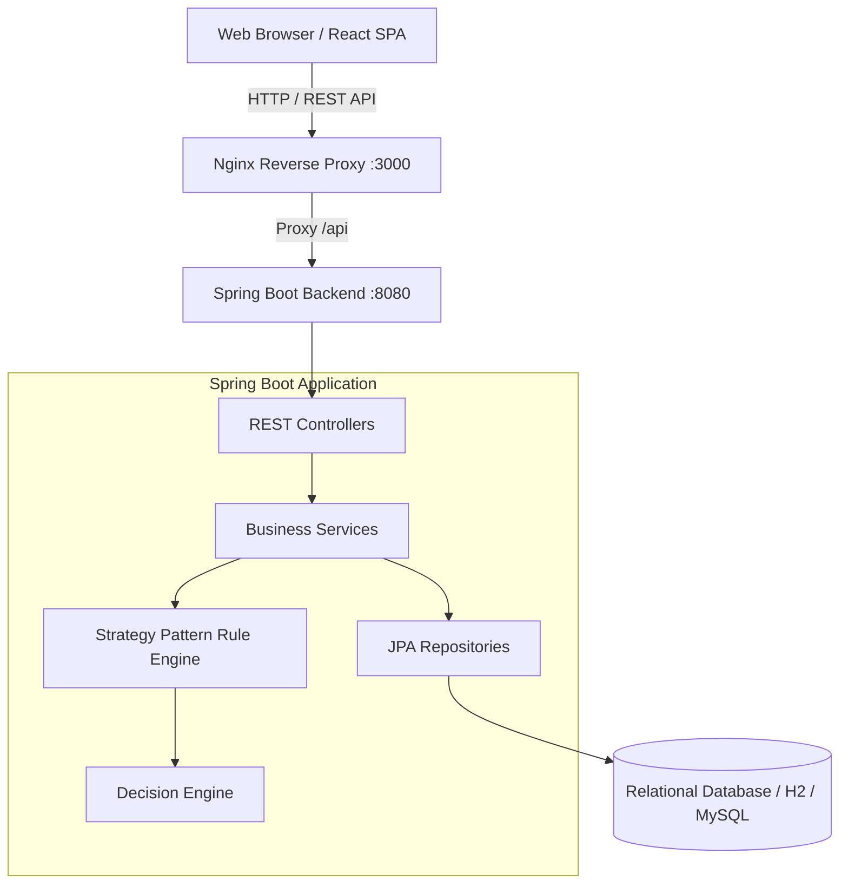
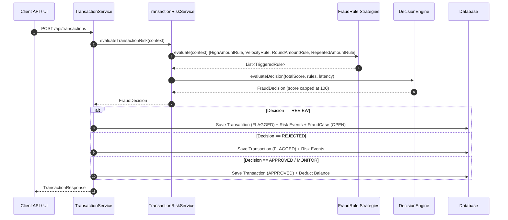
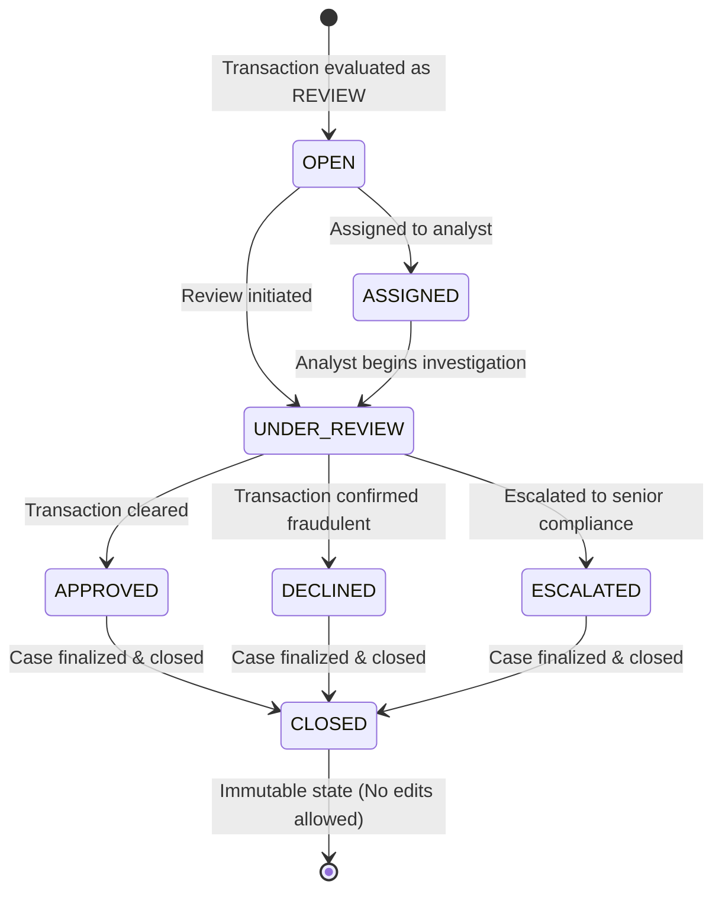
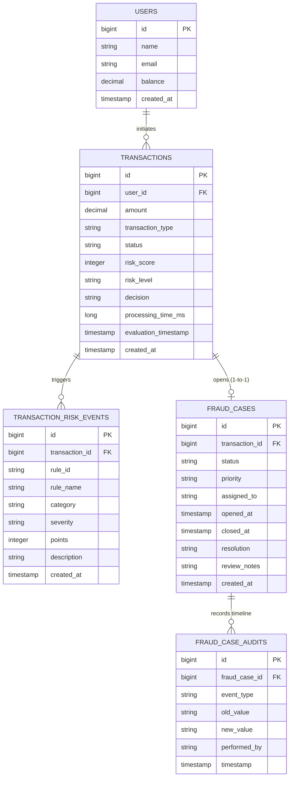
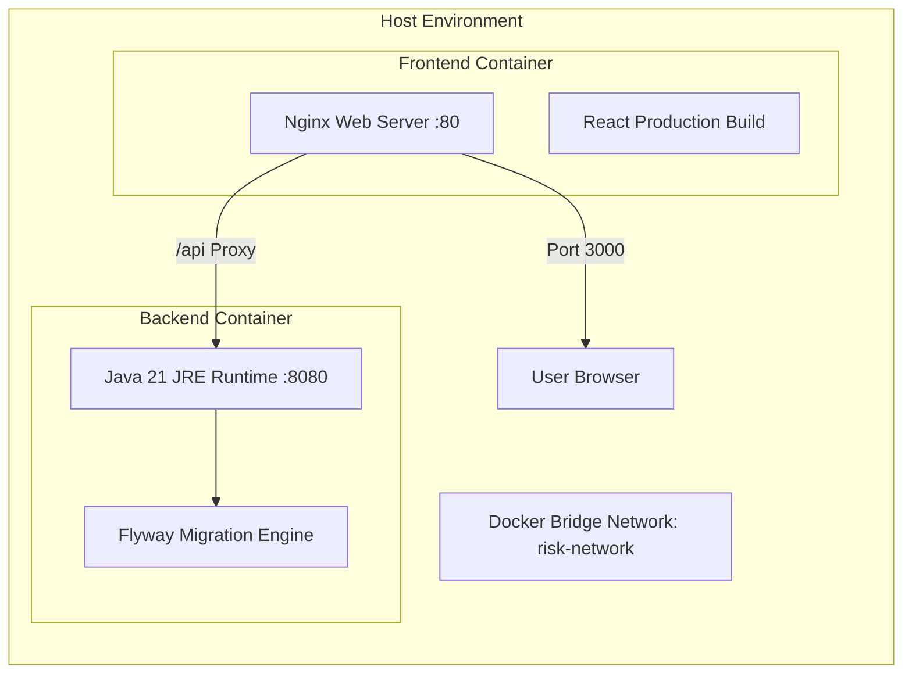

# System Architecture & Technical Specifications 🏗️

The **Transaction Risk Analysis Platform V2** is designed around a clean, layered, domain-driven architecture following the **Open/Closed Principle (OCP)** and **Strategy Pattern**.

---

## 1. Overall System Architecture

---

## 2. Fraud Evaluation Engine Flow

The rule engine evaluates transactions dynamically using registered `FraudRule` strategies without modifying the central orchestration layer.

---

## 3. Fraud Case Management State Machine

---

## 4. Database Entity-Relationship Diagram (ERD)

---

## 5. Container Deployment Architecture

